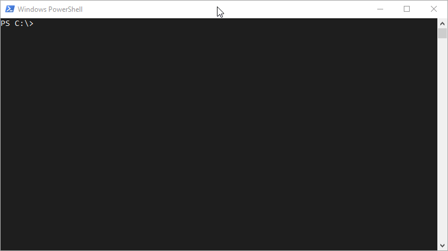

# PSReadline keyboard shortcuts
Add these code snippets to your profile in order to set the keybind.

If you have VScode installed, it's as simple as:
* Open a PowerShell window
* Type `code $PROFILE`
* Paste the code snippet in
* Save and exit

Note: If you do it directly from the VScode terminal, it will load it's own profile and not the one you actually want.

Now every time you load a PowerShell window, your profile will be loaded along with your new keybind. To remove, just simply edit the file again and remove the code.

## ExpandAliases.ps1
This will alow you to bind a key (such as `Ctrl+e`) to automatically convert any command aliases you have typed into the terminal to their full name. e.g `gci` > `Get-ChildItem`

